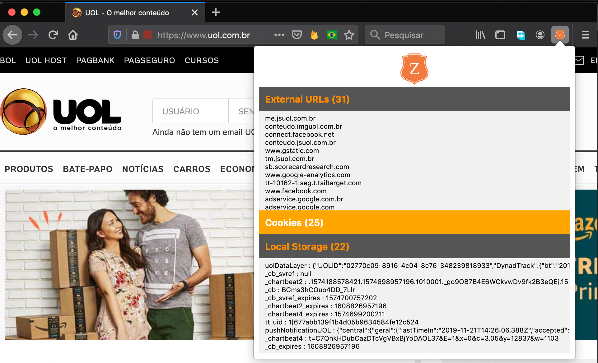

# Shieldzilla

This is a Firefox extension that displays external connections made by websites you visit, it also shows localStorage data and cookies, so you can be aware of how your privacy is being taken care of.

To run locally, open Firefox, navigate to `about:debugging`, select `This Firefox` and press `Load Temporary Add-on`, then select any file from the repo. 